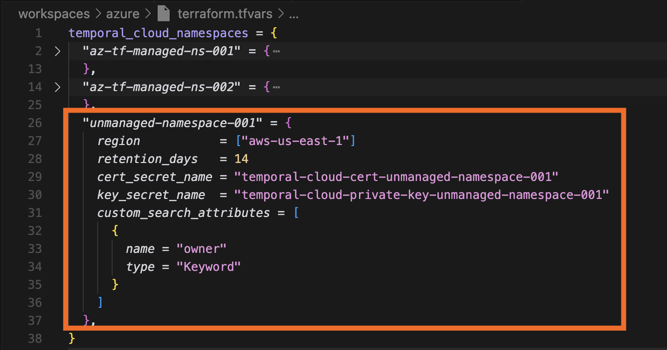

# Import Existing Temporal Cloud Namespaces in Terraform

A example guide on how to import existing Temporal Cloud namespace in Terraform.

## Instructions

1. Retrieve the [Temporal Cloud namespace ID](https://docs.temporal.io/cloud/namespaces#temporal-cloud-namespace-id)
from the Temporal Cloud console.
   - For the rest of this guide, it will be assumed that you are looking to import a Temporal
   Cloud namespace called `unmanaged-namespace-001.abcde`.

1. In [terraform.tfvars](./terraform.tfvars), add an item corresponding to
`unmanaged-namespace-001` to variable `temporal_cloud_namespaces`.
   - *Note*: you may have to import existing or create new mTLS certificate and private key
   in Azure Key Vault.

    

1. Run the following command to import the namespace into Terraform state.

    ```bash
    terraform import -var "az_subscription_id=${AZ_SUBSCRIPTION_ID}" -var-file="terraform.tfvars" \
        "temporalcloud_namespace.namespace[\"unmanaged-namespace-001\"]" unmanaged-namespace-001.abcde
    ```

    If the import operation is successful, you should see these outputs:

    ```text
    Import successful!

    The resources that were imported are shown above. These resources are now in
    your Terraform state and will henceforth be managed by Terraform.
    ```

1. Verify that `unmanaged-namespace-001.abcde` exists in Terraform state.

    ```bash
    terraform state list "temporalcloud_namespace.namespace"
    ```

    You should see the following resource in the output:

    ```text
    temporalcloud_namespace.namespace["unmanaged-namespace-001"]
    ```

1. After the `unmanaged-namespace-001.abcde` namespace is imported,
apply Terraform to prevent infrastructure drift.
Review the Terraform plan carefully before applying.

    ```bash
    export AZ_SUBSCRIPTION_ID=<azure-subscription-id>
    terraform apply -var "az_subscription_id=${AZ_SUBSCRIPTION_ID}" -var-file="terraform.tfvars"
